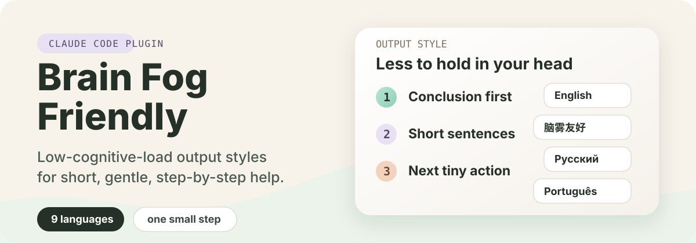

<p align="center">
  
</p>

# صديق لضباب الدماغ

[English](../../README.md) | [中文](./README.zh-CN.md) | [日本語](./README.ja.md) | [Русский](./README.ru.md) | العربية | [한국어](./README.ko.md) | [Español](./README.es.md) | [Français](./README.fr.md) | [Deutsch](./README.de.md) | [Português do Brasil](./README.pt-BR.md)

إضافة marketplace لـ Claude Code وCodex لردود منخفضة العبء المعرفي.

تساعد Claude وCodex على الإجابة بضغط أقل، وكثافة أقل، وخطوات تالية أوضح.

مناسبة للأشخاص الذين يعانون من ضباب الدماغ، أو صعوبة الانتباه، أو التعب، أو الإرهاق، أو لأي شخص يفضّل ردودًا هادئة وخطوة بخطوة.

## ما الذي تحصل عليه

عشرة أساليب رد مترجمة. تتوفر كأساليب إخراج في Claude Code ومن خلال مهارة إعداد في Codex.

| اللغة | أسلوب الإخراج |
| --- | --- |
| English | `Brain Fog Friendly` |
| 中文 | `脑雾友好` |
| 日本語 | `ブレインフォグにやさしい` |
| Русский | `Дружелюбный к мозговому туману` |
| العربية | `صديق لضباب الدماغ` |
| 한국어 | `브레인 포그 친화적` |
| Español | `Amigable para la niebla mental` |
| Français | `Adapté au brouillard cérébral` |
| Deutsch | `Brain-Fog-freundlich` |
| Português do Brasil | `Amigável para névoa mental` |

## ما الذي يغيّره هذا الأسلوب

يطلب من Claude أو Codex أن:

- يضع الخلاصة والخطوة التالية أولًا
- يستخدم جملًا قصيرة
- يستخدم فقرات قصيرة
- يقلل العبء المعرفي
- يتحرك خطوة صغيرة واحدة في كل مرة
- يتجنب الضغط، والحكم، وكثرة الخيارات
- يقدم خيارات بسيطة عندما يعلق المستخدم: المتابعة، تبسيط الشرح، أو التوقف مؤقتًا

## التثبيت

### Claude Code

أضف هذا المستودع كـ Claude Code marketplace:

```bash
claude plugin marketplace add zeldajay/brain-fog-friendly
```

ثم ثبّت الإضافة:

```bash
claude plugin install brain-fog-friendly@brain-fog-friendly-marketplace
```

### تطبيق ChatGPT لسطح المكتب

1. افتح تطبيق ChatGPT لسطح المكتب.
2. افتح **الإضافات**.
3. افتح قائمة **إنشاء ▾** في أعلى اليمين واختر **إضافة سوق إضافات**. أدخل `zeldajay/brain-fog-friendly` في **المصدر**، ثم اختر **إضافة السوق**.
4. افتح تبويب **شخصي** في صفحة الإضافات. افتح **Brain Fog Friendly** واختر زر علامة الجمع لتثبيته.
5. ابدأ محادثة جديدة لتحميل المهارة المضمّنة.

راجع [دليل إضافات ChatGPT وCodex الرسمي](https://learn.chatgpt.com/docs/plugins) لمعرفة الواجهات المدعومة وإدارة الإضافات.

### Codex CLI

أضف هذا المستودع كـ Codex marketplace:

```bash
codex plugin marketplace add zeldajay/brain-fog-friendly
```

ثم ثبّت الإضافة:

```bash
codex plugin add brain-fog-friendly@brain-fog-friendly-marketplace
```

## الاستخدام

### Claude Code

افتح إعدادات Claude Code:

```text
/config
```

ثم:

1. ابحث عن إعداد `Output style` (أسلوب الإخراج).
2. اضغط Enter لفتح قائمة أساليب الإخراج.
3. استخدم مفاتيح الأسهم للانتقال إلى أحد أساليب Brain Fog Friendly (مثل `Brain Fog Friendly` أو `صديق لضباب الدماغ`).
4. اضغط Enter لاختياره.
5. اضغط Esc للخروج من الإعدادات. الأسلوب مفعّل الآن.

### Codex CLI

استدعِ مهارة الإعداد بشكل صريح:

```text
$brain-fog-friendly
```

يعرض Codex قائمة مرقمة تضم عشر لغات وخيار التعطيل. أجب بالرقم أو اسم اللغة أو رمز اللغة.

### تطبيق ChatGPT لسطح المكتب

ابدأ محادثة جديدة، واكتب `@`، ثم اختر مهارة **Brain Fog Friendly**. بعد ذلك أجب عن قائمة اللغات برقم أو اسم لغة أو رمز لغة.

تضيف المهارة كتلة `brain-fog-friendly` مُدارة إلى الملف العام `~/.codex/AGENTS.md` أو تستبدلها. يزيل خيار التعطيل هذه الكتلة فقط ويحافظ على جميع التعليمات العامة الأخرى.

بعد التفعيل أو التبديل أو التعطيل، ابدأ سلسلة Codex جديدة ليعيد Codex تحميل التعليمات العامة.

## التطوير المحلي

### Claude Code

أضف هذا المستودع كـ marketplace محلي:

```bash
claude plugin marketplace add .
```

ثبّت من marketplace المحلي:

```bash
claude plugin install brain-fog-friendly@brain-fog-friendly-marketplace
```

تحقق من الإضافة:

```bash
claude plugin validate .
claude plugin validate ./output-styles/brain-fog-friendly
```

### Codex

أضف نسخة العمل هذه كـ marketplace محلي:

```bash
codex plugin marketplace add .
```

ثبّت من marketplace المحلي:

```bash
codex plugin add brain-fog-friendly@brain-fog-friendly-marketplace
```

## License

MIT
