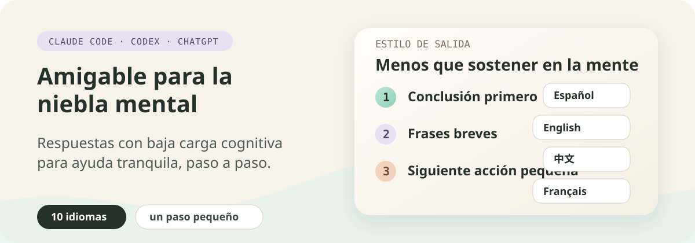

<p align="center">
  
</p>

# Amigable para la niebla mental

[English](../../README.md) | [中文](./README.zh-CN.md) | [日本語](./README.ja.md) | [Русский](./README.ru.md) | [العربية](./README.ar.md) | [한국어](./README.ko.md) | Español | [Français](./README.fr.md) | [Deutsch](./README.de.md) | [Português do Brasil](./README.pt-BR.md)

Un plugin de marketplace para Claude Code y Codex que ofrece respuestas con baja carga cognitiva.

Ayuda a Claude y Codex a responder con menos presión, menos densidad y pasos siguientes más claros.

Está pensado para personas con niebla mental, dificultad de atención, fatiga, saturación, o para cualquiera que prefiera respuestas tranquilas y paso a paso.

## Qué obtienes

Diez estilos de respuesta localizados. Están disponibles como estilos de salida de Claude Code y mediante un skill de configuración de Codex.

| Idioma | Estilo de salida |
| --- | --- |
| English | `Brain Fog Friendly` |
| 中文 | `脑雾友好` |
| 日本語 | `ブレインフォグにやさしい` |
| Русский | `Дружелюбный к мозговому туману` |
| العربية | `صديق لضباب الدماغ` |
| 한국어 | `브레인 포그 친화적` |
| Español | `Amigable para la niebla mental` |
| Français | `Adapté au brouillard cérébral` |
| Deutsch | `Brain-Fog-freundlich` |
| Português do Brasil | `Amigável para névoa mental` |

## Qué cambia este estilo

Le pide a Claude o Codex que:

- ponga primero la conclusión y el siguiente paso
- use frases cortas
- use párrafos cortos
- reduzca la carga cognitiva
- avance un pequeño paso a la vez
- evite la presión, el juicio y demasiadas opciones
- cuando la persona se bloquee, ofrezca opciones simples: continuar, simplificar o pausar

## Instalación

### Claude Code

Añade este repositorio como marketplace de Claude Code:

```bash
claude plugin marketplace add zeldajay/brain-fog-friendly
```

Luego instala el plugin:

```bash
claude plugin install brain-fog-friendly@brain-fog-friendly-marketplace
```

### Aplicación de escritorio de ChatGPT

1. Abre la aplicación de escritorio de ChatGPT.
2. Abre **Complementos**.
3. Abre el menú **Crear ▾** de la esquina superior derecha y selecciona **Añadir mercado de complementos**. Introduce `zeldajay/brain-fog-friendly` en **Fuente** y luego selecciona **Añadir mercado**.
4. Abre la pestaña **Personal** de la página Complementos. Abre **Brain Fog Friendly** y selecciona el botón más para instalarlo.
5. Inicia un chat nuevo para cargar el skill incluido.

Consulta la [guía oficial de plugins de ChatGPT y Codex](https://learn.chatgpt.com/docs/plugins) para conocer las superficies compatibles y la gestión de plugins.

### Codex CLI

Añade este repositorio como marketplace de Codex:

```bash
codex plugin marketplace add zeldajay/brain-fog-friendly
```

Luego instala el plugin:

```bash
codex plugin add brain-fog-friendly@brain-fog-friendly-marketplace
```

## Uso

### Claude Code

Abre la configuración de Claude Code:

```text
/config
```

Luego:

1. Busca la opción `Output style` (estilo de salida).
2. Pulsa Enter para abrir la lista de estilos de salida.
3. Usa las flechas para ir a uno de los estilos Brain Fog Friendly (por ejemplo `Brain Fog Friendly` o `Amigable para la niebla mental`).
4. Pulsa Enter para seleccionarlo.
5. Pulsa Esc para salir de la configuración. El estilo ya está activo.

### Codex CLI

Invoca explícitamente el skill de configuración:

```text
$brain-fog-friendly
```

Codex muestra una lista numerada con diez idiomas y una opción para desactivar. Responde con el número, el nombre del idioma o el código de idioma.

### Aplicación de escritorio de ChatGPT

Inicia un chat nuevo, escribe `@` y elige el skill **Brain Fog Friendly**. Después responde a la lista con un número, un nombre de idioma o un código de idioma.

El skill añade o reemplaza un bloque administrado `brain-fog-friendly` en el archivo global `~/.codex/AGENTS.md`. La opción de desactivar elimina solo ese bloque y conserva las demás instrucciones globales.

Después de activar, cambiar o desactivar el estilo, inicia un nuevo hilo de Codex para volver a cargar las instrucciones globales.

## Desarrollo local

### Claude Code

Añade este repositorio como marketplace local:

```bash
claude plugin marketplace add .
```

Instala desde el marketplace local:

```bash
claude plugin install brain-fog-friendly@brain-fog-friendly-marketplace
```

Valida el plugin:

```bash
claude plugin validate .
claude plugin validate ./output-styles/brain-fog-friendly
```

### Codex

Añade esta copia de trabajo como marketplace local:

```bash
codex plugin marketplace add .
```

Instala desde el marketplace local:

```bash
codex plugin add brain-fog-friendly@brain-fog-friendly-marketplace
```

## License

MIT
