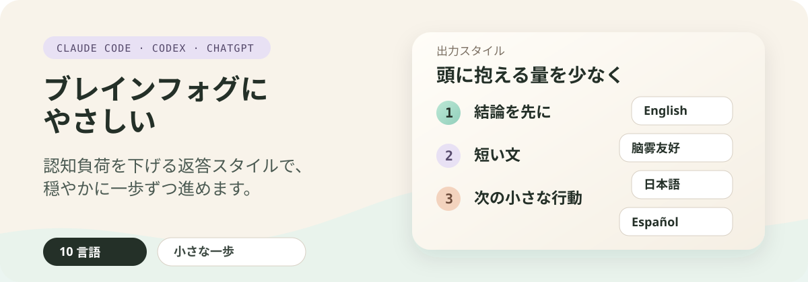

<p align="center">
  
</p>

# ブレインフォグにやさしい

[English](../../README.md) | [中文](./README.zh-CN.md) | 日本語 | [Русский](./README.ru.md) | [العربية](./README.ar.md) | [한국어](./README.ko.md) | [Español](./README.es.md) | [Français](./README.fr.md) | [Deutsch](./README.de.md) | [Português do Brasil](./README.pt-BR.md)

低い認知負荷の返答を提供する Claude Code と Codex の marketplace プラグインです。

Claude と Codex が、圧力を減らし、密度を下げ、次の一歩をより明確にして答えるようにします。

ブレインフォグ、注意の難しさ、疲労、圧倒感がある人、または穏やかで段階的な返答を好む人向けです。

## 得られるもの

十種類のローカライズ済み返答スタイル。Claude Code の出力スタイルとして、または Codex の設定スキルから利用できます。

| 言語 | 出力スタイル |
| --- | --- |
| English | `Brain Fog Friendly` |
| 中文 | `脑雾友好` |
| 日本語 | `ブレインフォグにやさしい` |
| Русский | `Дружелюбный к мозговому туману` |
| العربية | `صديق لضباب الدماغ` |
| 한국어 | `브레인 포그 친화적` |
| Español | `Amigable para la niebla mental` |
| Français | `Adapté au brouillard cérébral` |
| Deutsch | `Brain-Fog-freundlich` |
| Português do Brasil | `Amigável para névoa mental` |

## このスタイルが変えること

Claude または Codex に次のことを求めます：

- 結論と次の一歩を先に置く
- 短い文を使う
- 短い段落を使う
- 認知負荷を下げる
- 一度に一つの小さなステップで進む
- 圧力、判断、選択肢の多さを避ける
- ユーザーが詰まったときは、続ける、簡単に説明する、一時停止する、のような簡単な選択肢を出す

## インストール

### Claude Code

このリポジトリを Claude Code marketplace として追加します：

```bash
claude plugin marketplace add zeldajay/brain-fog-friendly
```

次にプラグインをインストールします：

```bash
claude plugin install brain-fog-friendly@brain-fog-friendly-marketplace
```

### ChatGPT デスクトップアプリ

1. ChatGPT デスクトップアプリを開きます。
2. **プラグイン** を開きます。
3. 右上の **作成 ▾** メニューを開き、**プラグインマーケットプレイスを追加** を選択します。**ソース** に `zeldajay/brain-fog-friendly` と入力し、**マーケットプレイスを追加** を選択します。
4. プラグインページの **個人** タブを開きます。**Brain Fog Friendly** を開き、プラスボタンを選択してインストールします。
5. 新しいチャットを開始し、同梱スキルを読み込ませます。

対応している画面とプラグイン管理については、公式の [ChatGPT と Codex のプラグインガイド](https://learn.chatgpt.com/docs/plugins) を参照してください。

### Codex CLI

このリポジトリを Codex marketplace として追加します：

```bash
codex plugin marketplace add zeldajay/brain-fog-friendly
```

次にプラグインをインストールします：

```bash
codex plugin add brain-fog-friendly@brain-fog-friendly-marketplace
```

## 使い方

### Claude Code

Claude Code の設定を開きます：

```text
/config
```

その後：

1. `Output style`（出力スタイル）の設定を見つけます。
2. Enter を押して出力スタイルの一覧を開きます。
3. 矢印キーで Brain Fog Friendly のスタイル（例：`Brain Fog Friendly` または `ブレインフォグにやさしい`）に移動します。
4. Enter を押して選択します。
5. Esc を押して設定を閉じます。これでスタイルが有効になります。

### Codex CLI

設定スキルを明示的に呼び出します：

```text
$brain-fog-friendly
```

Codex は十言語と無効化オプションを含む番号付きリストを表示します。番号、言語名、または言語コードで返答してください。

### ChatGPT デスクトップアプリ

新しいチャットを開始し、`@` を入力して **Brain Fog Friendly** スキルを選択します。その後、番号、言語名、または言語コードで言語リストに返答します。

このスキルは、グローバルな `~/.codex/AGENTS.md` 内の管理対象 `brain-fog-friendly` ブロックを追加または置換します。無効化を選ぶと、そのブロックだけが削除され、その他のグローバル指示は保持されます。

有効化、切り替え、無効化の後は、Codex がグローバル指示を再読み込みできるよう、新しい Codex スレッドを開始してください。

## ローカル開発

### Claude Code

このリポジトリをローカル marketplace として追加します：

```bash
claude plugin marketplace add .
```

ローカル marketplace からインストールします：

```bash
claude plugin install brain-fog-friendly@brain-fog-friendly-marketplace
```

プラグインを検証します：

```bash
claude plugin validate .
claude plugin validate ./output-styles/brain-fog-friendly
```

### Codex

このチェックアウトをローカル marketplace として追加します：

```bash
codex plugin marketplace add .
```

ローカル marketplace からインストールします：

```bash
codex plugin add brain-fog-friendly@brain-fog-friendly-marketplace
```

## License

MIT
